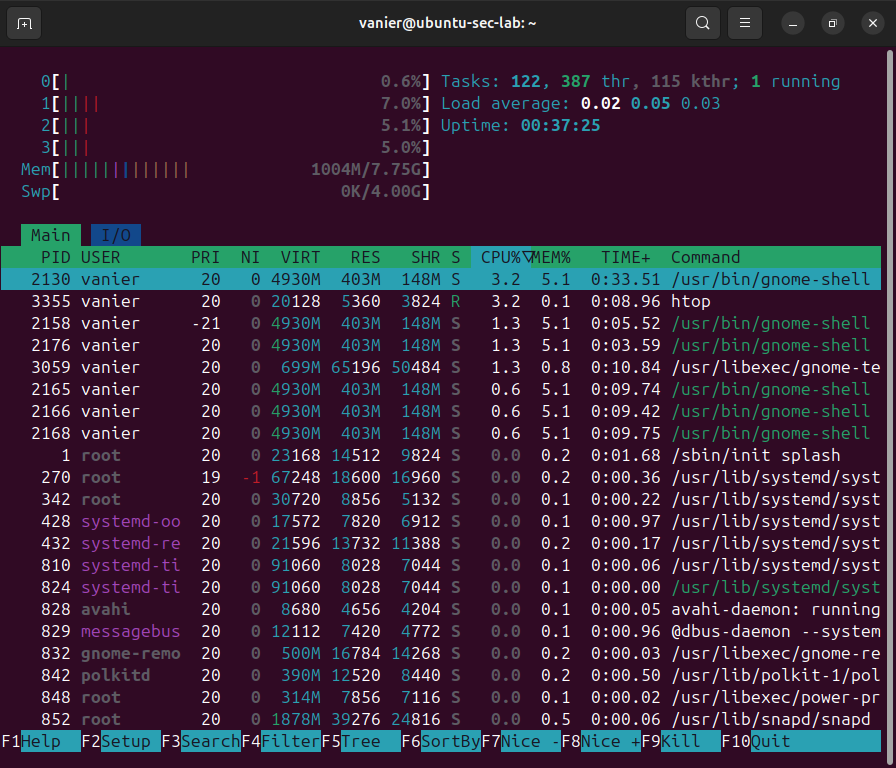

## System Monitor Lab

### Objective
Monitor and control system processes using Linux tools in a virtualized environment.

### Tools Used
- htop (interactive process monitoring)
- ps aux (process listing)
- kill (process termination)

### Steps Performed
1. Installed and launched htop
2. Observed CPU, memory, and running processes
3. Created a test process using:
   sleep 500 &
4. Located the process using search inside htop
5. Terminated the process using SIGTERM

### Key Concepts Learned
- Process ID (PID)
- Background vs foreground processes
- Real-time monitoring
- Safe process termination

### Outcome
Successfully simulated and controlled system activity using Linux tools.

## Screenshot

